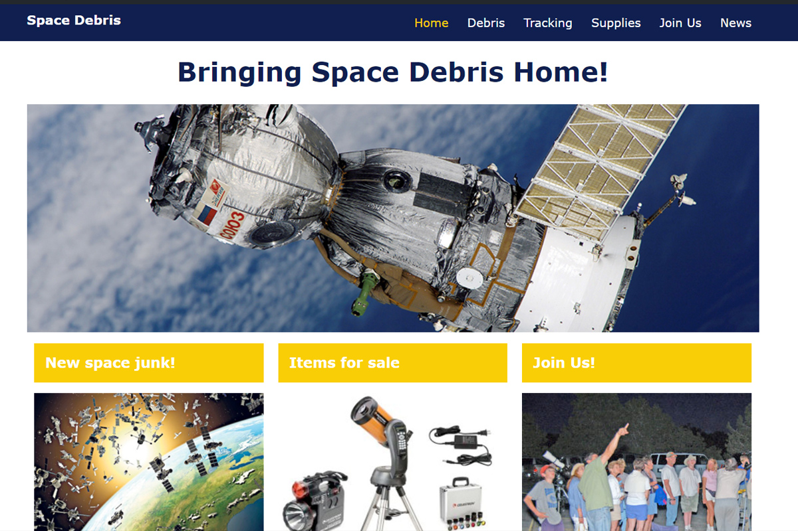

# Space Debris

[Link to Demo](http://spacedebris.alexandrpasko.com/)

Space Debris is a database driven, dynamically generated multi-page website representing Space Debris company. The website is created in WordPress framework by building a custom theme in PHP. Layout of the website is created according to given Photoshop files. The website graphic elements were extracted by slicing PSD files. Some WordPress plagins were installed and integrated as well.

## Technologies/Languages:
* MySQL
* PHP
* Wordpress
* Bootstrap
* Photoshop

## Screenshot:
